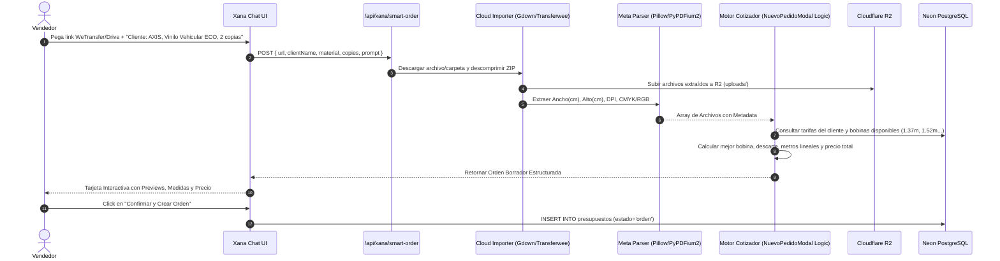

# 📐 Especificación Técnica y Arquitectura: Ecosistema LuXius (XignuX)

**Versión:** 2.1 - Producción  
**Fecha:** Septiembre 2026  
**Propósito del Documento:** Documentación técnica integral para auditoría, revisión de arquitectura y evaluación por modelos de Inteligencia Artificial externos.

---

## 1. 🏗️ Resumen Ejecutivo y Arquitectura Global

**LuXius** es un sistema integral de gestión de producción para imprentas digitales de gran formato y gigantografía (XignuX). Gestiona el ciclo de vida completo de un trabajo: cotización, ingestión de archivos pesados, previsualización, asignación de bobinas de impresión, flujo de taller/RIP, logística y facturación.

### Stack Tecnológico
* **Frontend:** React 18, TypeScript, Vite, CSS modular (Vanilla CSS con diseño Rich Dark Mode / Cyberpunk industrial), PDF-Lib, PDF.js. Alojado en **GitHub Pages** con CDN global.
* **Backend:** Python 3.12, Flask, Flask-CORS, SQLAlchemy 2.0, Gunicorn, Boto3, Pillow, PyPDFium2, Transferwee, Gdown. Alojado en **Render** (Web Service).
* **Almacenamiento Primario (Operativo de Alta Velocidad):** **Cloudflare R2** (`luxius-media`) compatible con S3 (Zero Egress Fees).
* **Almacenamiento Secundario (Bóveda Histórica Corporativa):** **Google Drive API v3** (Estructura organizada por Cliente / Año / Mes).
* **Base de Datos Central:** **PostgreSQL en Neon Serverless** (Pooler con SSL activo).
* **Base de Datos Local / Fallback:** SQLite (`luxius.db`).
* **Inteligencia Artificial & Memoria:** Motor **Xana** (LangGraph / LangChain / Gemini) conectado a la base de conocimiento y tablas relacionales (`xana_knowledge`, `xana_decisions`, `xana_tasks`).

```
┌────────────────────────────────────────────────────────────────────────────────────────┐
│                                   LUXIUS SYSTEM                                        │
└────────────────────────────────────────────────────────────────────────────────────────┘
                                         │
        ┌────────────────────────────────┼────────────────────────────────┐
        ▼                                ▼                                ▼
┌──────────────────┐           ┌──────────────────┐             ┌──────────────────┐
│ FRONTEND WEB     │           │ BACKEND API      │             │ TALLER / RIP     │
│ (GitHub Pages)   │           │ (Render Python)  │             │ (PC Local Taller)│
│ TypeScript/Vite  │◄─────────►│ Flask/SQLAlchemy │◄───────────►│ Daemon HotFolder │
└──────────────────┘           └──────────────────┘             └──────────────────┘
        │                                │                                │
        │                       ┌────────┴────────┐                       │
        │                       ▼                 ▼                       ▼
        │             ┌─────────────────┐ ┌───────────────┐     ┌──────────────────┐
        └────────────►│ Cloudflare R2   │ │ Neon Postgres │     │ RIP Software     │
                      │ (Streaming R2)  │ │ (Base Central)│     │ PhotoPrint/Roland│
                      └─────────────────┘ └───────────────┘     └──────────────────┘
                                │
                                ▼
                      ┌─────────────────┐
                      │ Google Drive    │
                      │ (Bóveda Backup) │
                      └─────────────────┘
```

---

## 2. ⚡ Estado Actual Implementado y Verificado

1. **Subida y Streaming Híbrido R2:**
   - Endpoint `/uploads/<filename>` y `/api/preview/<filename>`: Verifica disco local; si no existe (servidor efímero de Render), transmite el stream directamente desde Cloudflare R2 (`luxius-media/uploads/`) y genera una copia en caché local.
   - Endpoint `/api/upload`: Guarda en disco y sincroniza inmediatamente a Cloudflare R2.
   - Endpoint `/api/download`: Descarga segura mediante proxy con cabeceras `Content-Disposition: attachment; filename="nombre_produccion.ext"`, sin bloqueos de dominio.
   - 318 archivos históricos multimedia y de órdenes sincronizados en Cloudflare R2.

2. **Sistema Anti-Caché y Sincronización en Vivo:**
   - Generación de `version.json` con `__BUILD_TIMESTAMP__` en cada build.
   - Motor `versionCheck.ts` que valida versiones en segundo plano, purga Service Workers y recarga bundles automáticamente.
   - Botón `🔄 SINCRONIZAR` en el Header para forzar actualización de datos frescos y purga de caché.

3. **Autenticación y Persistencia JWT:**
   - Secreto constante en backend para mantener sesiones activas ante reinicios o suspensión de dynos en Render.
   - Tokens con vigencia de 30 días e interceptores frontend que capturan `401 Unauthorized`.

---

## 3. 📋 ESPECIFICACIÓN DETALLADA DE LAS 3 NUEVAS IMPLEMENTACIONES

---

### 🤖 MÓDULO 1: Creación Inteligente de Pedidos con Xana AI

#### Problema que resuelve:
Actualmente, el usuario debe descargar manualmente los archivos pesados enviados por clientes (vía WeTransfer o Google Drive), descomprimir los ZIPs, abrir los archivos en Illustrator/Photoshop para medir el ancho, alto y DPI, y luego abrir el modal `NuevoPedidoModal` para tipear los datos a mano y calcular la bobina.

#### Flujo Arquitectónico:


#### Especificación de Endpoints:

##### `POST /api/xana/smart-order`
* **Request:**
  ```json
  {
    "url": "https://we.tl/t-xxxxxx",
    "cliente_id": 45,
    "cliente_nombre": "AXIS",
    "material_default": "VV",
    "calidad_default": "ECO",
    "copias_default": 2,
    "observaciones": "Trabajo urgente para camioneta"
  }
  ```
* **Response:**
  ```json
  {
    "success": true,
    "draft_order": {
      "cliente_id": 45,
      "cliente_nombre": "AXIS",
      "descripcion": "Orden AXIS - 4 Archivos Importados",
      "material": "VV",
      "calidad": "ECO",
      "copias": 2,
      "bobina_asignada": 1.37,
      "consumo_ml": 8.45,
      "precio_total": 185900.0,
      "archivos": [
        "1788310000_capot.jpg",
        "1788310001_techo.jpg"
      ],
      "carteles": [
        {
          "nombre": "capot.jpg",
          "ancho_cm": 135.0,
          "alto_cm": 187.0,
          "dpi": 72,
          "color_mode": "RGB",
          "copias": 2,
          "bobina_sugerida": 1.37,
          "preview_url": "https://luxius-backend.onrender.com/uploads/1788310000_capot.jpg"
        }
      ]
    }
  }
  ```

---

### ☁️ MÓDULO 2: Bóveda de Respaldo Histórico en Google Drive (R2 ↔ Drive)

#### Problema que resuelve:
Cloudflare R2 es excelente para servir archivos en caliente a bajo costo, pero las empresas de gráfica necesitan un archivo histórico navegable por carpetas en su Google Drive corporativo para auditorías o búsquedas manuales por año, mes y cliente.

#### Arquitectura de Sincronización:
1. **Credenciales:** Google Service Account (`credentials.json` o secret env `GOOGLE_SERVICE_ACCOUNT_JSON`).
2. **Jerarquía en Google Drive:**
   ```
   📁 00_LUXIUS_BOVEDA_EMPRESA
     └── 📁 2026
         └── 📁 09_SEPTIEMBRE
             └── 📁 CLIENTE_AXIS
                 └── 📁 OT_AA559B46_MADER_HILUX
                     ├── 1788229090158_mader_hilux_techo.jpg
                     ├── 1788229057508_mader_hilux_capot.jpg
                     └── Presupuesto_OT-AA559B46.pdf
   ```
3. **Automatización:**
   - Tarea Cron nocturna en el backend (`sync_r2_to_drive.py`).
   - Webhook al cambiar una orden a estado `completada` o `archivada`.
   - Se almacena el `google_drive_folder_id` en la tabla `presupuestos` para que el botón *"Ver en Drive"* abra la carpeta con un clic.

---

### 🖨️ MÓDULO 3: Daemon de Taller & Hot Folder RIP

#### Problema que resuelve:
El operador del taller de impresión pasa horas descargando archivos de la nube, renombrándolos para saber de qué cliente son, cuántas copias van y en qué material se imprimen, y arrastrándolos al software RIP (**PhotoPrint / Roland VersaWorks / Flexi / Onyx**).

#### Arquitectura del Daemon:
1. **Instalación:** Un script Python empaquetado o servicio de segundo plano en Windows que se ejecuta en la PC del taller.
2. **Configuración (`daemon_config.json`):**
   ```json
   {
     "API_URL": "https://luxius-backend.onrender.com/api",
     "API_TOKEN": "token_del_taller",
     "HOT_FOLDER_DIR": "C:\\HotFolders\\Impresion_ECO\\",
     "POLL_INTERVAL_SECONDS": 10,
     "ALLOWED_MATERIALS": ["VV", "VBB", "LONA"]
   }
   ```
3. **Mapeo de Nombres Estandarizados para el RIP:**
   El Daemon descarga el archivo directamente desde Cloudflare R2 con la nomenclatura que el RIP lee en su visor de cola:
   ```
   OT-[ID]_[COPIAS]x_[MATERIAL]_[CALIDAD]_[ANCHO]x[ALTO] --- [NOMBRE_ARCHIVO].[EXT]
   ```
   *Ejemplo real:* `OT-AA559B46_x2_VV_ECO_1.310x1.150 --- mader hilux techo.jpg`

4. **Sincronización de Estado Bidireccional:**
   - Cuando el archivo se copia con éxito en la Hot Folder, el Daemon envía un `POST /api/orders/{id}/rip-status` marcando la orden con la etiqueta verde: `📥 En Cola RIP`.

---

## 4. 🗄️ Esquema de Base de Datos (Tablas Clave)

### Tabla `presupuestos` (Órdenes de Trabajo)
| Campo | Tipo | Descripción |
| :--- | :--- | :--- |
| `id` | VARCHAR(50) PRIMARY KEY | Identificador único / UUID (ej: `aa559b46-...`) |
| `numero_presupuesto` | INTEGER | Número correlativo autoincremental |
| `cliente_id` | INTEGER | Clave foránea hacia tabla `clientes` |
| `descripcion` | TEXT | Título o descripción del trabajo |
| `estado` | VARCHAR(20) | `orden`, `diseno`, `impresion`, `taller`, `entregado`, `cancelado` |
| `especificaciones` | JSONB | Dimensiones, copias, material, calidad, bobinaUsada, consumoEstimado, archivosOriginales, imgMetadata (DPI, colorMode) |
| `total` | NUMERIC(12,2) | Importe final facturado |
| `drive_folder_id` | VARCHAR(100) | ID de la carpeta en Google Drive para respaldo |
| `created_at` | TIMESTAMP WITH TIME ZONE | Fecha y hora de creación UTC |

### Tabla `xana_knowledge` (Memoria Técnica de IA)
| Campo | Tipo | Descripción |
| :--- | :--- | :--- |
| `id` | INTEGER PRIMARY KEY | Autoincremental |
| `topic` | VARCHAR(255) | Tema de la memoria (ej: Arquitectura R2, Reglas de Cotización) |
| `content` | TEXT | Conocimiento estructurado, instrucciones y soluciones |
| `tags` | JSONB | Array de etiquetas (`['r2', 'cotizacion', 'rip']`) |
| `updated_at` | TIMESTAMP WITH TIME ZONE | Última fecha de actualización |

---

## 5. 🛡️ Consideraciones de Seguridad y Resiliencia

1. **Prevención de SSRF y Cifrado:**
   - Las descargas externas de WeTransfer y Google Drive validan esquemas HTTPS y usan buffers de tamaño controlado (máximo 100 MB por lote).
2. **Resiliencia ante Fallos de Red:**
   - Si Cloudflare R2 experimenta latencia, el endpoint de streaming realiza hasta 3 reintentos antes de devolver un error controlado.
   - Si Google Drive agota su cuota de API, el daemon de respaldo reencola los archivos en `sync_log` sin interrumpir la operación del panel web.
3. **Integridad de Datos:**
   - Se realizan respaldos locales periódicos completos (JSON dumps de todas las tablas de PostgreSQL + SQLite + Códigos fuentes en ZIP).

---

## 6. 🚀 Preguntas para la Evaluación de Otras IAs
Si vas a consultar la opinión de otra IA sobre este diseño técnico, estas son excelentes preguntas para formularle:
1. *¿Es sólida la arquitectura de almacenamiento dual (Cloudflare R2 para streaming web rápido + Google Drive para archivo histórico corporativo)?*
2. *¿Qué mejoras recomiendas en el Daemon local de la Hot Folder para garantizar que no haya archivos duplicados en la cola del software RIP (PhotoPrint/VersaWorks)?*
3. *¿Qué validaciones adicionales agregarías a la extracción de medidas con Pillow/PyPDFium2 para evitar errores de escala en archivos con medidas proporcionales (ej: escala 1:10)?*
