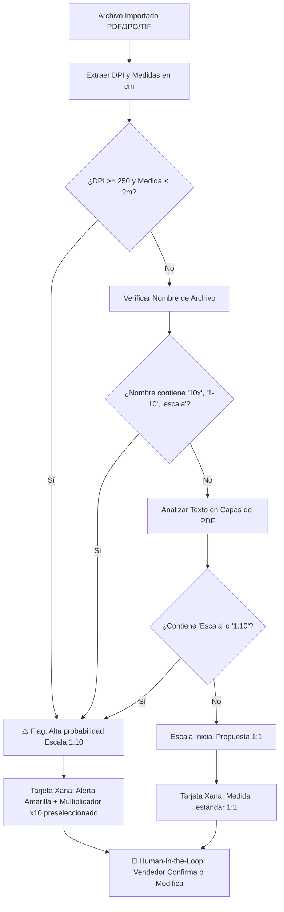
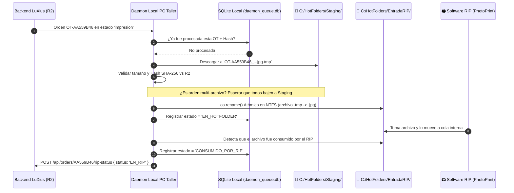

# 🚀 Roadmap Definitivo & Arquitectura Blindada: Ecosistema LuXius (XignuX)

**Versión:** 2.2 — Arquitectura Industrial Consolidada  
**Fecha:** 01 de Septiembre, 2026  
**Propósito:** Especificación técnica completa que integra la potencia operativa de LuXius con los blindajes y controles de calidad para talleres de gigantografía e imprenta digital de gran formato.

---

## 🏛️ 1. Principios de Arquitectura & Fuentes de Verdad

Para garantizar consistencia absoluta en el taller y en la nube, se establecen las siguientes reglas de autoridad:

```
┌─────────────────────────────────────────────────────────────────────────────────────────────────┐
│                                  JERARQUÍA DE DATOS Y ESTADOS                                   │
├─────────────────────────┬──────────────────────────────────────┬────────────────────────────────┤
│ Capa                    │ Componente                           │ Rol en el Sistema              │
├─────────────────────────┼──────────────────────────────────────┼────────────────────────────────┤
│ 1. Base de Datos Master │ Neon PostgreSQL (Serverless SSL)     │ Autoridad Única de Datos       │
│ 2. Storage Operativo    │ Cloudflare R2 (`luxius-media`)       │ Master Operativo (Hot Storage) │
│ 3. Storage Histórico    │ Google Workspace Shared Drive        │ Mirror / Bóveda (Cold Storage) │
│ 4. Taller Físico        │ PC RIP Daemon (SQLite Local)         │ Receptor de Producción Atómico │
└─────────────────────────┴──────────────────────────────────────┴────────────────────────────────┘
```

1. **R2 es el Master Operativo:** Todo lo que se previsualiza, cotiza y se manda a imprimir sale de Cloudflare R2.
2. **Google Drive es el Mirror Corporativo:** Bóveda de auditoría y archivo histórico organizado. En caso de discrepancia, R2 manda sobre la producción activa.
3. **Integridad Criptográfica:** Todo archivo que entra al ecosistema recibe un hash **SHA-256** inmutable en la base de datos para validar transferencias entre R2, Drive y el RIP.
4. **Seguridad JWT con Revocación:** Se añade `token_version` a la tabla `usuarios` para permitir revocación instantánea de sesiones ante cambios de contraseña o bajas de personal, manteniendo la longevidad de 30 días para operarios activos.

---

## 🗺️ 2. ROADMAP DE IMPLEMENTACIÓN EN 3 FASES

```
[FASE 1: ENTRADA INTELIGENTE]       [FASE 2: BÓVEDA GOOGLE DRIVE]       [FASE 3: DAEMON HOT FOLDER RIP]
• Ingesta WeTransfer & Drive        • Workspace Shared Drive (Sin 15GB) • Descarga Atómica (.tmp -> rename)
• Heurística Anti-Escala 1:10       • Hash SHA-256 de Integridad        • SQLite Local de Cola en Daemon
• Human-in-the-Loop Obligatorio     • Reconciliación Anti-Drift (Cron)  • Ingesta en Bloque Multi-archivo
• Blindaje SSRF & IP Privadas       • Versionado de Archivos (_v2)      • Detección de Consumo por RIP
```

---

## 🤖 FASE 1: Xana Smart Orders & Motor Heurístico Anti-Escala

### 1.1 Ingesta Cloud & Blindaje SSRF (`routes/cloud_import.py`)
- **Soporte de Enlaces:**
  - WeTransfer cortos (`we.tl/...`) y largos (`wetransfer.com/downloads/...`) vía `transferwee` + fallback HTTP directo.
  - Google Drive: Archivos individuales (`/file/d/...`) y Carpetas completas (`/folders/...`) vía `gdown`.
  - Descompresión automática de `.zip` y `.rar` en memoria/disco temporal.
- **🛡️ Blindaje SSRF Estricto:**
  - Validación de esquemas `https://` exclusivamente.
  - **Bloqueo de Redes Internas / Metadata Cloud:** Rechazo automático de URLs que resuelvan a `127.0.0.1`, `10.0.0.0/8`, `172.16.0.0/12`, `192.168.0.0/16`, `169.254.169.254` (AWS/GCP/Render metadata endpoint) y `localhost`.
  - Tamaño máximo por lote: 500 MB (buffer controlado con streaming a R2).

### 1.2 Motor Heurístico Anti-Escalas (1:10 / 1:20)
*El mayor riesgo en gigantografía es interpretar un archivo de 100x30 cm a 300 DPI como tamaño final en lugar de una lona real de 10x3 metros.*



- **Reglas del Motor Heurístico:**
  1. **Regla de Densidad Cruzada:** Si el archivo tiene $\ge 250\text{ DPI}$ y sus dimensiones de lienzo son menores a $200\text{ cm}$, pero el cliente cotiza vía pública o cartel grande $\rightarrow$ Sugerir automáticamente multiplicador $\times 10$.
  2. **Análisis de Nomenclatura:** Detección de patrones regex en nombres (ej: `*10x3m*`, `*esc1-10*`, `*10%*`).
  3. **OCR / Extracción de Capas PDF:** Búsqueda de strings textuales tipo *"Escala 1:10"* o *"Medida final: ..."*.
  4. **Preferencia Guardada por Cliente:** Si un cliente habitual (ej: `AXIS`) siempre trabaja en 1:10, Xana lo recuerda y lo propone por defecto.

### 1.3 Human-in-the-Loop & Cotización Automática
- **Cálculo de Bobinas:** Selección de la bobina de menor desperdicio ($1.00\text{m}, 1.37\text{m}, 1.52\text{m}, 1.60\text{m}, 1.80\text{m}, 3.20\text{m}$).
- **Tarjeta Interactiva en Chat (`XanaAssistant.tsx`):**
  - Muestra miniaturas, dimensiones reales calculadas y DPI.
  - **Selector de Escala Obligatorio:** `[ 1:1 ]` `[ 1:10 (Recomendada) ]` `[ 1:20 ]` `[ Personalizada ]`.
  - Desglose de metros lineales (ml), demasías, servicios y precio total.
  - **`[ ✅ Confirmar y Crear ]`** $\rightarrow$ Inserta en `presupuestos` de PostgreSQL.
  - **`[ ✏️ Abrir en Modal ]`** $\rightarrow$ Pasa el borrador a `NuevoPedidoModal` para edición manual.

---

## ☁️ FASE 2: Bóveda Histórica en Google Drive con Shared Drive & Reconciliación

### 2.1 Google Workspace Shared Drive (Evitando el límite de 15 GB)
- Las Service Accounts de Google tienen una cuota personal de solo 15 GB.
- **Solución Implementada:** La Service Account se agrega como miembro con permisos de *"Administrador de contenido"* a una **Unidad Compartida (Shared Drive)** de la empresa (`GOOGLE_DRIVE_SHARED_DRIVE_ID`), permitiendo almacenamiento corporativo ilimitado.

### 2.2 Estructura Jerárquica y Versionado
- Estructura en Google Drive:
  ```
  📁 00_LUXIUS_BOVEDA
    └── 📁 2026
        └── 📁 09_SEPTIEMBRE
            └── 📁 AXIS
                └── 📁 OT_AA559B46_MADER_HILUX
                    ├── OT-AA559B46_x2_VV_ECO_1.310x1.150 --- techo.jpg
                    ├── OT-AA559B46_x2_VV_ECO_1.310x1.150 --- techo_rev2.jpg  (Versionado)
                    └── Presupuesto_OT-AA559B46.pdf
  ```
- **Control de Colisiones y Versiones:** Si un cliente envía un archivo corregido, no se sobreescribe a ciegas; se archiva como `_v2` / `_rev` y se actualiza el puntero activo en la base de datos para garantizar trazabilidad.

### 2.3 Job de Reconciliación Anti-Drift (`reconcile_r2_drive.py`)
- Un job programado (Cron nocturno o endpoint `/api/sync/reconcile`) realiza una auditoría cruzada:
  1. Lista los registros de la tabla `presupuestos` de los últimos 30 días.
  2. Verifica que cada archivo existente en Cloudflare R2 tenga su copia idéntica (mismo SHA-256) en la carpeta correspondiente de Google Drive.
  3. Si detecta archivos faltantes (por caídas temporales de red o cuota de API de Google), los reencola y sincroniza automáticamente.
- **Política de Ciclo de Vida (Lifecycle):** Opcional a los 60 días de entregada la orden: purgar el original pesado de R2 manteniendo el thumbnail web en R2 y el master de alta resolución en Google Drive.

---

## 🖨️ FASE 3: Daemon de Taller & Hot Folder RIP Blindada

### 3.1 Descarga Atómica a Staging (Cero Archivos Corruptos en el RIP)
*Los RIPs como PhotoPrint y VersaWorks fallan si leen un archivo mientras se está escribiendo en disco.*



### 3.2 Componentes del Daemon Local (`server/daemon/luxius_daemon.py`)
1. **SQLite Local (`daemon_queue.db`):**
   - Tabla `queue_items`: `(id, order_id, file_name, file_hash, local_path, status, downloaded_at, consumed_at)`.
   - Garantiza que reinicios de la PC o caídas de internet no dupliquen archivos en la cola de impresión.
2. **Descarga Atómica en NTFS:**
   - La carpeta `Staging/` y `EntradaRIP/` residen en la misma unidad de disco (`C:\` o `D:\`). El método `os.replace()` / `os.rename()` es una operación atómica a nivel de punteros del sistema de archivos; el RIP jamás ve un archivo incompleto.
3. **Manejo de Órdenes Multi-archivo (Batch):**
   - Si una orden tiene 5 piezas para un vehículo, el Daemon descarga las 5 en staging y las libera en bloque a la Hot Folder del RIP.
4. **Watchdog de Cola Trabada:**
   - Si un archivo pasa más de 20 minutos en la Hot Folder sin ser tomado por el RIP, el Daemon emite una alerta en el panel de LuXius: `⚠️ Alerta Taller: RIP detenido o cola trabada`.

---

## 📊 3. Matriz de Riesgos & Mitigaciones

| Riesgo Técnico / Operativo | Impacto | Mitigación Implementada |
| :--- | :---: | :--- |
| **Error de escala (1:10 interpretado como 1:1)** | **CRÍTICO** | Motor heurístico de densidad cruzada (DPI vs cm) + selector de escala obligatorio en UI + confirmación humana. |
| **RIP lee archivo a medio descargar** | **ALTO** | Descarga atómica a carpeta `Staging/` con extensión `.tmp` y `os.rename()` final en el mismo volumen NTFS. |
| **Límite de 15 GB de Google Service Account** | **ALTO** | Integración obligatoria con Google Workspace **Shared Drive (Unidad Compartida)** corporativa. |
| **Ataques SSRF vía Cloud Importer** | **ALTO** | Allowlist de esquemas HTTPS y bloqueo a nivel de socket de rangos IP privados (`10.x`, `192.168.x`, `169.254.x`). |
| **Archivos duplicados al reiniciar PC de taller** | **MEDIO** | Mini base SQLite local en el Daemon con hash SHA-256 e historial de órdenes procesadas. |
| **Pérdida de sincronización R2 ↔ Drive (Drift)** | **MEDIO** | Job nocturno de reconciliación que audita y repara discrepancias automáticamente. |

---

## 🎯 4. Conclusión para Revisión Externa

Este roadmap resuelve tanto la **experiencia de usuario ágil** (vendedores creando pedidos en segundos pegando links) como la **seguridad operativa en fábrica** (cero impresiones fallidas por escalas erróneas y cero archivos corruptos en los RIPs).
