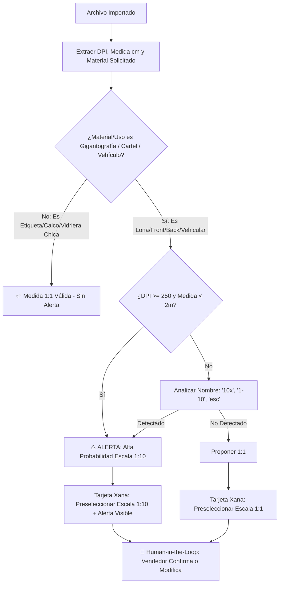
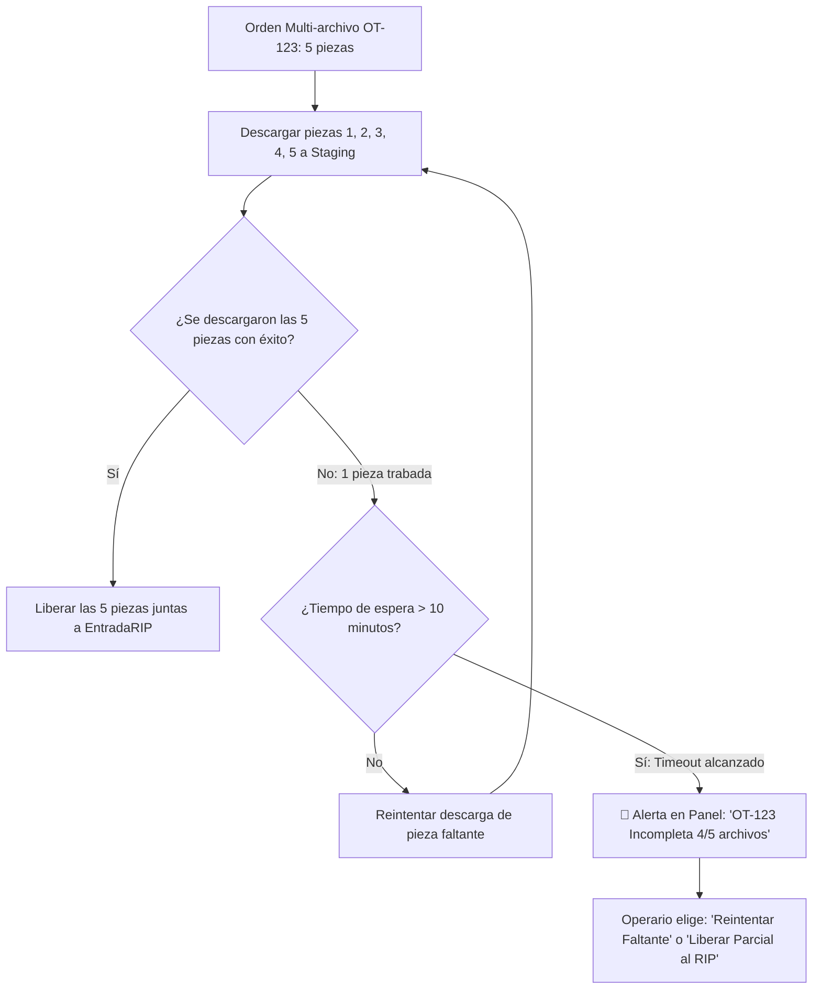

# 🚀 Roadmap Definitivo & Arquitectura Blindada: Ecosistema LuXius (XignuX)

**Versión:** 2.2 — Arquitectura Industrial Consolidada  
**Fecha:** 01 de Septiembre, 2026  
**Propósito:** Especificación técnica completa que integra la potencia operativa de LuXius con los blindajes y controles de calidad para talleres de gigantografía e imprenta digital de gran formato.

---

## 🏛️ 1. Principios de Arquitectura & Fuentes de Verdad

Para garantizar consistencia absoluta en el taller y en la nube, se establecen las siguientes reglas de autoridad:

```
┌─────────────────────────────────────────────────────────────────────────────────────────────────┐
│                                  JERARQUÍA DE DATOS Y ESTADOS                                   │
├─────────────────────────┬──────────────────────────────────────┬────────────────────────────────┤
│ Capa                    │ Componente                           │ Rol en el Sistema              │
├─────────────────────────┼──────────────────────────────────────┼────────────────────────────────┤
│ 1. Base de Datos Master │ Neon PostgreSQL (Serverless SSL)     │ Autoridad Única de Datos       │
│ 2. Storage Operativo    │ Cloudflare R2 (`luxius-media`)       │ Master Operativo (Hot Storage) │
│ 3. Storage Histórico    │ Google Workspace Shared Drive        │ Mirror / Bóveda (Cold Storage) │
│ 4. Taller Físico        │ PC RIP Daemon (SQLite Local)         │ Receptor de Producción Atómico │
└─────────────────────────┴──────────────────────────────────────┴────────────────────────────────┘
```

1. **R2 es el Master Operativo:** Todo lo que se previsualiza, cotiza y se manda a imprimir sale de Cloudflare R2.
2. **Google Drive es el Mirror Corporativo:** Bóveda de auditoría y archivo histórico organizado. En caso de discrepancia, R2 manda sobre la producción activa.
3. **Integridad Criptográfica:** Todo archivo que entra al ecosistema recibe un hash **SHA-256** inmutable en la base de datos para validar transferencias entre R2, Drive y el RIP.
4. **Seguridad JWT con Revocación:** Se añade `token_version` a la tabla `usuarios` para permitir revocación instantánea de sesiones ante cambios de contraseña o bajas de personal, manteniendo la longevidad de 30 días para operarios activos.

---

## 🗺️ 2. ROADMAP DE IMPLEMENTACIÓN EN 3 FASES

```
[FASE 1: ENTRADA INTELIGENTE]       [FASE 2: BÓVEDA GOOGLE DRIVE]       [FASE 3: DAEMON HOT FOLDER RIP]
• Ingesta WeTransfer & Drive        • Workspace Shared Drive (Sin 15GB) • Descarga Atómica (.tmp -> rename)
• Heurística Anti-Escala 1:10       • Hash SHA-256 de Integridad        • SQLite Local de Cola en Daemon
• Human-in-the-Loop Obligatorio     • Reconciliación Anti-Drift (Cron)  • Ingesta en Bloque Multi-archivo
• Blindaje SSRF & IP Privadas       • Versionado de Archivos (_v2)      • Detección de Consumo por RIP
```

---

## 🤖 FASE 1: Xana Smart Orders & Motor Heurístico Anti-Escala

### 1.1 Ingesta Cloud, Checksum en Origen & Blindaje SSRF (`routes/cloud_import.py`)
- **⚓ Ancla de Verdad: Checksum SHA-256 en Punto de Entrada:**
  - En el **mismo instante** en que el stream de datos se descarga desde WeTransfer o Google Drive, se calcula y almacena el hash **`original_sha256`** antes de cualquier procesamiento o movimiento.
  - Este hash viaja en el objeto de la orden (`especificaciones.archivos_metadata[i].sha256`) y actúa como la fuente inmutable contra la cual verificarán R2, Google Drive y el Daemon del RIP.
- **Soporte de Enlaces:**
  - WeTransfer cortos (`we.tl/...`) y largos (`wetransfer.com/downloads/...`) vía `transferwee` + fallback HTTP directo.
  - Google Drive: Archivos individuales (`/file/d/...`) y Carpetas completas (`/folders/...`) vía `gdown`.
  - Descompresión automática de `.zip` y `.rar`.
- **🛡️ Blindaje SSRF Estricto:**
  - Validación de esquemas `https://` exclusivamente.
  - **Bloqueo de Redes Internas / Metadata Cloud:** Rechazo automático de URLs que resuelvan a `127.0.0.1`, `10.0.0.0/8`, `172.16.0.0/12`, `192.168.0.0/16`, `169.254.169.254` (AWS/GCP/Render metadata endpoint) y `localhost`.
  - Tamaño máximo por lote: 500 MB (buffer controlado con streaming a R2).

### 1.2 Motor Heurístico Tridimensional Anti-Escalas (DPI $\times$ Tamaño $\times$ Uso/Material)
*Para evitar la fatiga de alertas y falsos positivos en trabajos chicos legítimos (ej: calcomanías de 20x20 cm a 300 DPI), la heurística evalúa 3 dimensiones simultáneas:*



- **Dimensiones de la Heurística:**
  1. **Dimensión de Material/Familia:** Si el material es `LONA_FRONT`, `LONA_BACK`, `VINILO_VEHICULAR` o `CARTELERIA`, se activan los filtros de alerta. Si es `CALCOS`, `STICKERS` o `PAPEL_FOTOGRAFICO`, se permite alta resolución en tamaño pequeño sin disparar alertas molestas.
  2. **Dimensión de Densidad:** $\text{DPI} \ge 250$ en lienzos $< 200\text{ cm}$ para gigantografía $\rightarrow$ Alerta activa.
  3. **Dimensión Textual:** Coincidencia en nombre de archivo o capas de texto del PDF (*"Escala 1:10"*).
  4. **Perfil del Cliente:** Si el cliente habitualmente trabaja a escala (ej: `AXIS`), el sistema recuerda su preferencia.

### 1.3 Human-in-the-Loop & Cotización Automática
- **Tarjeta Interactiva en Chat (`XanaAssistant.tsx`):**
  - Muestra miniaturas, dimensiones calculadas y selector de escala obligatorio: `[ 1:1 ] [ 1:10 (Sugerida) ] [ 1:20 ] [ Personalizada ]`.
  - Desglose de metros lineales (ml), demasías, bobina asignada y precio total.
  - **`[ ✅ Confirmar y Crear ]`** $\rightarrow$ Inserta en `presupuestos` de PostgreSQL con su `original_sha256`.

---

## ☁️ FASE 2: Bóveda Histórica en Google Drive con Shared Drive & Reconciliación Clasificada

### 2.1 Google Workspace Shared Drive (Evitando el límite de 15 GB)
- La Service Account se añade a una **Unidad Compartida (Shared Drive)** de Workspace (`GOOGLE_DRIVE_SHARED_DRIVE_ID`), garantizando cuotas corporativas ilimitadas sin depender del espacio personal de 15 GB.

### 2.2 Reconciliación Inteligente Clasificada (No Reintento Ciego)
- El job nocturno de reconciliación (`reconcile_r2_drive.py`) audita la integridad comparando los hashes SHA-256 y clasifica las discrepancias en 3 categorías:
  1. **`MISSING_NEW` (Falta de subida inicial por corte de red o cuota API):** Reintento automático en segundo plano.
  2. **`HASH_MISMATCH` (Discrepancia de checksum entre R2 y Drive):** **NO sobreescribe a ciegas.** Emite alerta crítica en el panel de administración: `⚠️ Error de Integridad en OT-XXXX`.
  3. **`LIFECYCLE_PURGED` (Archivo archivado deliberadamente tras 60 días):** Reconocido por la política de retención sin intentar re-subirlo a R2.

### 2.3 Versionado de Archivos
- Si el cliente envía correcciones de un archivo, se almacena como `nombre_v2.jpg` en Drive y R2, preservando el historial de cambios y evitando que el RIP imprima la versión anterior por error.

---

## 🖨️ FASE 3: Daemon de Taller, Hot Folder RIP & Manejo de Timeouts

### 3.1 Descarga Atómica a Staging
- Descarga inicial a `C:\HotFolders\Staging\archivo.tmp`.
- Validación de hash SHA-256 contra el `original_sha256` registrado en el punto de entrada.
- Operación `os.replace()` atómica en el mismo sistema de archivos NTFS hacia `C:\HotFolders\EntradaRIP\`.

### 3.2 Manejo de Lotes Multi-Archivo y Timeout de Seguridad
*Evita que una orden de 5 archivos quede bloqueada indefinidamente si 1 archivo falla en la descarga.*



- **SQLite Local en Daemon (`daemon_queue.db`):** Persiste el estado de cada archivo de la orden para sobrevivir a reinicios de la PC.
- **Detección de Consumo Real:** Monitorea cuando el software RIP mueve el archivo de la carpeta de entrada a su cola interna de ripeo, enviando la confirmación `CONSUMIDO_POR_RIP` a LuXius.
- **Watchdog de Cola Trabada:** Alerta al panel si un archivo pasa >20 minutos en la Hot Folder sin ser procesado por el RIP.

---

## 🛡️ 4. Seguridad, Autenticación y Revocación JWT

1. **Mecanismo de Revocación de Sesiones:**
   - Se incorpora la columna `token_version` (Integer, default 1) en la tabla `usuarios`.
   - El payload del JWT incluye `{ user_id, token_version }`.
   - El middleware valida que el `token_version` coincida con el de la base de datos.
   - Si un usuario cambia su clave o el administrador lo da de baja, se incrementa `token_version = token_version + 1`, revocando de inmediato todas las sesiones activas en cualquier dispositivo.

