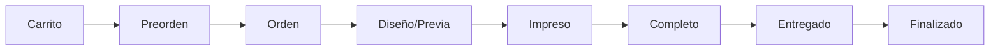
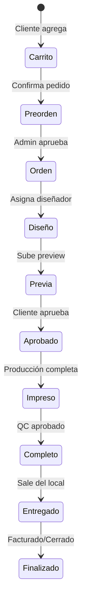

# IMPGESV2 - Análisis Completo del Sistema

> **Documento de Ingeniería Inversa para Replicación como Luxius**
> 
> Última actualización: 2026-01-27
> URL Original: http://192.168.1.101/impgesv2/admin/index.php

---

## 1. Visión General del Sistema

IMPGESV2 es un **Sistema de Gestión de Impresión** (Print Shop Management System) que administra todo el flujo de trabajo desde la recepción de pedidos hasta la entrega final. Utiliza PHP/MySQL con una interfaz web clásica.

### Flujo Principal de Trabajo


### Estadísticas del Sistema (Capturadas)
| Métrica | Valor |
|---------|-------|
| Carrito | 0 |
| Preordenes | 0 |
| Ordenes | 12 |
| Impresos | 3,219 |
| Completos | 84,668 |
| Entregados | 21 |
| Finalizados | 8,022 |

---

## 2. Roles y Permisos

El sistema maneja **6 roles principales**:

| ID | Rol | Descripción |
|----|-----|-------------|
| 1 | Principal | Acceso total (super admin) |
| 2 | Administración | Gestión completa sin configuración sistema |
| 3 | Vendedor | Entrada de pedidos y clientes |
| 4 | Cliente | Portal de clientes (limitado) |
| 5 | Impresión | Cola de impresión y producción |
| 6 | Diseño | Cola de diseño y previews |

### Credenciales de Prueba
- **Admin**: paola / pgof123 (Nivel 3)
- **Diseñador**: adrian.dis / mejico
- **Impresor**: adrian.imp / mejico

---

## 3. Módulos del Sistema

### 3.1 INICIO (Dashboard)
- Calendario mensual con navegación (Hoy, <, >)
- Widget de búsqueda rápida
- Widget de estadísticas (Presupuestos)
- Datos útiles (contacto empresa)
- Barra de estado: usuario activo, perfil, fecha/hora, mensajes

### 3.2 ENTRADA (Gestión de Pedidos)

#### Formulario de Nuevo Pedido (Modal)
**Tab "Trabajos":**
| Campo | Tipo | Descripción |
|-------|------|-------------|
| Cliente | Autocomplete | Búsqueda de clientes existentes |
| Calidad | Dropdown | Nivel de calidad del trabajo |
| Material | Dropdown | Sustrato a utilizar |
| Alto | Número | Altura en metros |
| Ancho | Número | Ancho en metros |
| Copias | Número | Cantidad de unidades |
| Logística | Dropdown | Método de envío/retiro |
| Extras | Dropdown | Accesorios adicionales |
| Urgencia | Checkbox | Marca de trabajo urgente |
| Observaciones | Textarea x2 | Notas del trabajo |
| Archivo | File Upload | Diseño del cliente |
| Laminado | Checkbox | Proceso de laminado |
| Bordado | Checkbox | Proceso de bordado |
| Panelizado | Checkbox | Trabajo panelizado |
| Portabanners | Número | Cantidad de soportes |

**Tab "Promos":**
| Campo | Tipo |
|-------|------|
| Promoción | Dropdown |
| Cantidad | Número |
| Unitario | Moneda |
| SubTotal | Calculado |

#### Tabla de Órdenes
Columnas: Previa, Id/OT, Estado, Origen/Fecha, Entrega Pactada, Cliente, Material/Info, Alto, Ancho, Copias, Total, Demasías, Acc., Envío, Emergencia, Operaciones

#### Acciones por Orden
- **Resumen**: Vista rápida del pedido
- **Previa**: Gestión de preview/aprobación
- **Ver Orden**: Detalle completo
- **Descarga**: Archivos del diseño
- **Reimprime**: Para trabajos completados

### 3.3 DISEÑO (Cola de Diseñadores)
- Cola de trabajos pendientes de diseño
- Gestión de previews (pruebas de color/aprobación)
- Estados: Orden → Previa → Aprobado
- Descarga de archivos fuente
- Líneas de producción: Plus, Solvente, Sublimado, Promos

### 3.4 IMPRESIÓN (Cola de Producción)

#### Máquinas Configuradas
| ID | Nombre |
|----|--------|
| 1 | Maquina 1 (740 Nueva) |
| 2 | Maquina 2 (740 vieja) |
| 3 | Maquina 3 (640) |
| 4 | Anidado 4 axis |

#### Columnas de Cola
Id, Fecha OK, Fecha, Entrega Pactada, Cliente, Material, Alto, Ancho, Copias, Anidado (asignación máquina)

#### Acciones
- OK Impreso (marcar completado)
- Descarga archivos
- Editar detalles
- Info detallada
- Observaciones
- Reporte de Sala

### 3.5 ABM (Alta/Baja/Modificación)

| Entidad | Subcategorías |
|---------|---------------|
| Personas | Clientes, Proveedores, Usuarios |
| Habilitaciones | Permisos temporales |
| Calidades | Promocional, Plus Solvente, Clasica, Sublimado |
| Productos | Productos, Rollos, Gastos Varios, Materias Primas |
| Combos | Paquetes promocionales |
| Monedas | Peso Argentino, US Dollar |
| Cajas | Cuentas de caja |
| Bancos | Cuentas bancarias |
| Anidados | Máquinas de producción |

#### Formulario de Cliente/Persona
Campos: Relación, ID IMPO, Nombre, CUIT, Empaque, Empresa, Categoría, Cond. Vta, Responsable, Usuario, Password, Rol, Fecha Inicio, VIP

### 3.6 REPORTES

#### Tipos de Reportes Disponibles
**Financieros:**
- Movimientos - Encajes de Caja
- Movimientos - Autorizaciones
- Movimientos - Movimientos de Caja

**Cuentas:**
- Cuentas Corrientes (Proveedores)
- Cuentas Corrientes Clientes v.2

**Stock:**
- Stock - Inventario
- Stock - Faltantes

**Compras:**
- Compras (Insumos, Materia Prima, Tareas Externas)

**Ventas:**
- Ventas - Facturación v.4
- Facturación Detallado
- Facturación Unitarios
- Facturación Mensual x Material
- Facturación Calidad Plus/Promocional
- Ventas - Pendientes de Entrega v.1/v.3

**Impuestos:**
- IVA Compras
- IVA Ventas
- Retenciones
- Descuentos Otorgados

**Producción:**
- Sala de Impresión v.1

### 3.7 SISTEMA

#### Permisos
Gestión de roles: Principal, Administración, Vendedor, Cliente, Impresión, Diseño

#### Respaldo (Email)
Configuración de envío de reportes por email

#### Utilidades de DB
- Respaldo de la Información (backup completo)
- Limpiar Base (limpieza histórica)
- Convierte a Mayúsculas (normalización)
- Reinicio de Saldos (Clientes, Cajas, Retiros)
- Baja de Trabajos Procesos

#### Mensajes
Sistema de mensajería interno

---

## 4. Estructura de Base de Datos (Inferida)

### Tablas Principales
```
├── personas (clientes, proveedores, usuarios)
├── ordenes (pedidos de trabajo)
├── ordenes_detalle (líneas de cada orden)
├── materiales
├── calidades
├── productos
├── rollos
├── combos
├── monedas
├── cajas
├── bancos
├── maquinas (anidados)
├── habilitaciones
├── mensajes
├── permisos
└── configuracion
```

### Relaciones Clave
- ordenes.cliente_id → personas.id
- ordenes_detalle.orden_id → ordenes.id
- ordenes_detalle.material_id → materiales.id
- ordenes.maquina_id → maquinas.id

---

## 5. Flujo de Estados de Orden



---

## 6. Screenshots de Referencia

| Módulo | Archivo |
|--------|---------|
| Login | [click_feedback_1769519727289.png](file:///C:/Users/Impresion/.gemini/antigravity/brain/46931fd1-15f6-4389-ad37-32705a9110b5/.system_generated/click_feedback/click_feedback_1769519727289.png) |
| Entrada | [entrada_module_list_1769520014983.png](file:///C:/Users/Impresion/.gemini/antigravity/brain/46931fd1-15f6-4389-ad37-32705a9110b5/entrada_module_list_1769520014983.png) |
| Impresión | [impresion_queue_1769520761493.png](file:///C:/Users/Impresion/.gemini/antigravity/brain/46931fd1-15f6-4389-ad37-32705a9110b5/impresion_queue_1769520761493.png) |
| ABM | [abm_menu_1769521114074.png](file:///C:/Users/Impresion/.gemini/antigravity/brain/46931fd1-15f6-4389-ad37-32705a9110b5/abm_menu_1769521114074.png) |
| Reportes | [reportes_menu_1769522350157.png](file:///C:/Users/Impresion/.gemini/antigravity/brain/46931fd1-15f6-4389-ad37-32705a9110b5/reportes_menu_1769522350157.png) |
| Sistema | [sistema_config_1769522533846.png](file:///C:/Users/Impresion/.gemini/antigravity/brain/46931fd1-15f6-4389-ad37-32705a9110b5/sistema_config_1769522533846.png) |

---

## 7. Grabaciones de Navegación

| Módulo | Archivo WebP |
|--------|--------------|
| Admin Login | [impgesv2_admin_login_1769519692913.webp](file:///C:/Users/Impresion/.gemini/antigravity/brain/46931fd1-15f6-4389-ad37-32705a9110b5/impgesv2_admin_login_1769519692913.webp) |
| Entrada | [impgesv2_entrada_module_1769519812966.webp](file:///C:/Users/Impresion/.gemini/antigravity/brain/46931fd1-15f6-4389-ad37-32705a9110b5/impgesv2_entrada_module_1769519812966.webp) |
| Diseño | [impgesv2_diseno_module_1769520163788.webp](file:///C:/Users/Impresion/.gemini/antigravity/brain/46931fd1-15f6-4389-ad37-32705a9110b5/impgesv2_diseno_module_1769520163788.webp) |
| Impresión | [impgesv2_impresion_module_1769520707146.webp](file:///C:/Users/Impresion/.gemini/antigravity/brain/46931fd1-15f6-4389-ad37-32705a9110b5/impgesv2_impresion_module_1769520707146.webp) |
| ABM | [impgesv2_admin_abm_1769521076805.webp](file:///C:/Users/Impresion/.gemini/antigravity/brain/46931fd1-15f6-4389-ad37-32705a9110b5/impgesv2_admin_abm_1769521076805.webp) |
| Reportes/Sistema | [impgesv2_reportes_sistema_1769522013207.webp](file:///C:/Users/Impresion/.gemini/antigravity/brain/46931fd1-15f6-4389-ad37-32705a9110b5/impgesv2_reportes_sistema_1769522013207.webp) |
